# Ecommerce MERN stack Project

## Table of Contents

- [Introduction](#introduction)
- [Features](#features)
- [Screenshots](#screenshots)
- [Installation](#installation)
- [Usage](#usage)
- [Backend](#backend)
- [Frontend](#frontend)

## Introduction

This project is a full stack eCommerce wesbite, developed using MERN stack(MongoDb, Express.js, React.js, Node.js) . It includes features like user authentication, tweeting, following users, liking, and retweeting tweets. The project is divided into frontend (using react, sass and js) and backend (using express.js and node.js, and MongoDB as database).

## Features

### User Authentication

- **Registration**: Users can create a new account by providing their details.
- **Login**: Existing users can log in with their email and password.
- **Logout**: Users can securely log out of their accounts.
- **Admin account**: A user can be given admin access which allows him to special actions restricted to admins.

### Home Page

- A welcoming animated Gradient Homecover followed by a Slider that shows the featured products

### Products Page

- **Filters**: User has the option to filter the products by categories and subcategories
- **Browse Products**: Use can browse through the Products cards here, add the items to cart or go to the product's details page.

### Search page

- User can search for any item in the serach bar, and he's navigated to the search page to easily find the product they want to check.

### Navbar

- **Tob bar**: Website Logo, search bar, a login button (if not logged in) / Profile + logout button (if logged in)
- **Bottom bar**: Quick links to Home page, Products page and various categories and subcategories.

### Profile Page

- **Profile Details**: Displays User's name and user's email id
- **User Actions**: User has options to update email id or reset his password.
- **Admin Dashboard**: User also sees admin dashboard button if he's registered as an admin.
- **Order History**: User's past orders are listed here, they can also go to the order's detail page via clicking on any order here.

### Handling Orders

- **Cart Page**:
  - When items are added to cart, they can be seen on this page.
  - It displays each item, their respective quantities and at the bottom, the total price including tax.
  - The items in the cart are stored in database hence you can access your cart from any device and the changes are reflected.
- **Shipping Page**:
  - When user clicks on "Proceed to Payment" button on cart page, you're redirected to this page.
  - User can select one of the addresses that are saved in the database or
  - User can add a new address.
- **Payment Method**:
  - User is then redirected to the payment method where he can select the mode of payment
- **Order Summary**:
- Finally the user is redirected to the order summary page where he can see the order summary and decide to place the order.

### Admin Dashboard

This page can be accessed via profile page, if the user is an admin.

- **Admin User Actions**:

  - The admin can see the list of all users that are registered on the website.
  - Clicking on any user will reveal the user details page which include his user id, email address, name and the option to toggle their admin access

- **Admin Product Actions**:
  - These actions include Adding a product, deleting a product or updating it's details.

### Backend

- **Authentication**: Secures endpoints using JWT authentication.
- **User Management**: Handles user registration.
- **Product Management**: Manages Products, fetching them, and adding items to cart
- **Order Managemnet**: Creates orders of products by users and links them to their id.

### Frontend

- **React**: The application is built using React for a responsive and dynamic user experience.
- **Styling**: Styles are managed using CSS and responsiveness is managed using bootstrap

## Screenshots

### Home Page

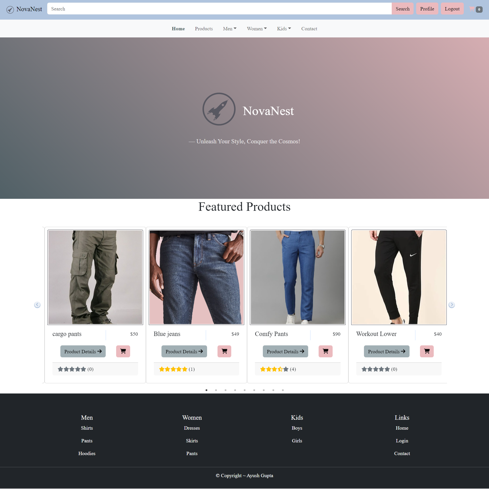

### Products Page

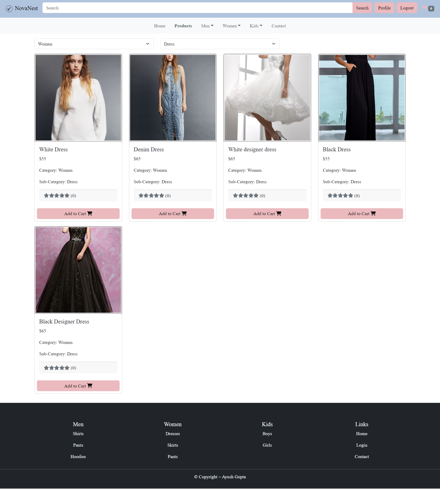

### Product Details Page

### Search Page

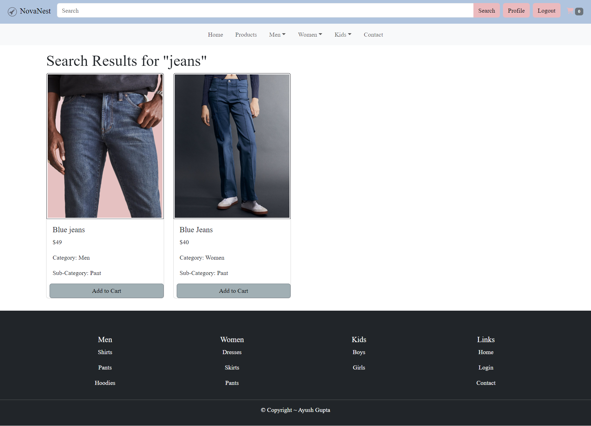

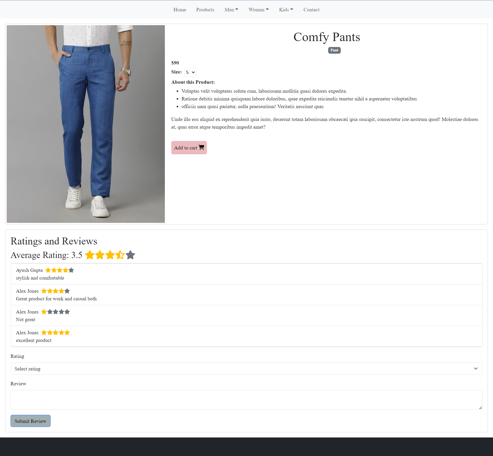

### Profile Page

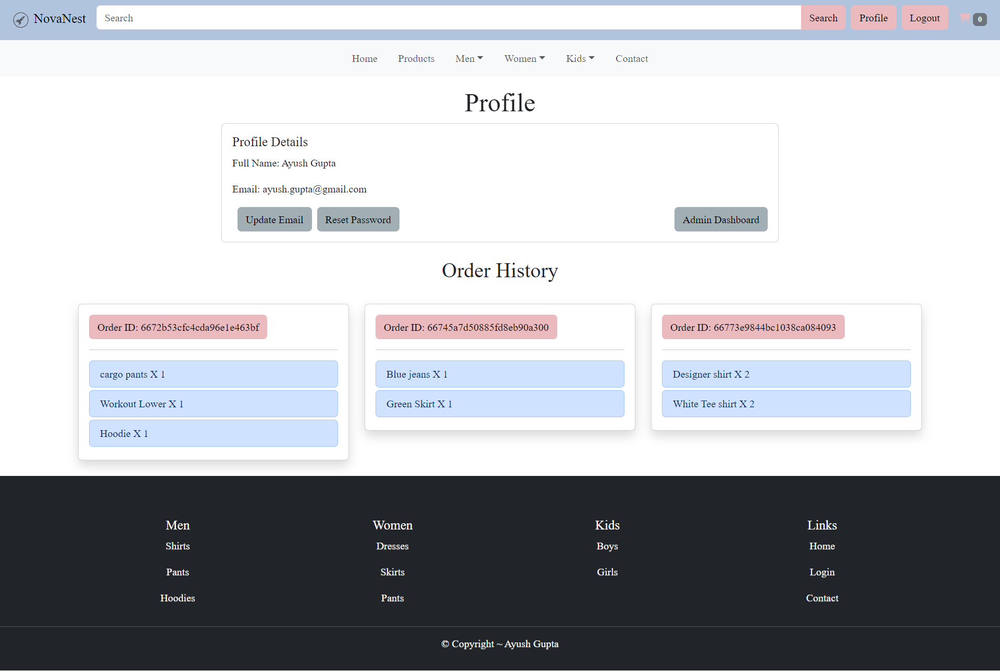

### Cart Page

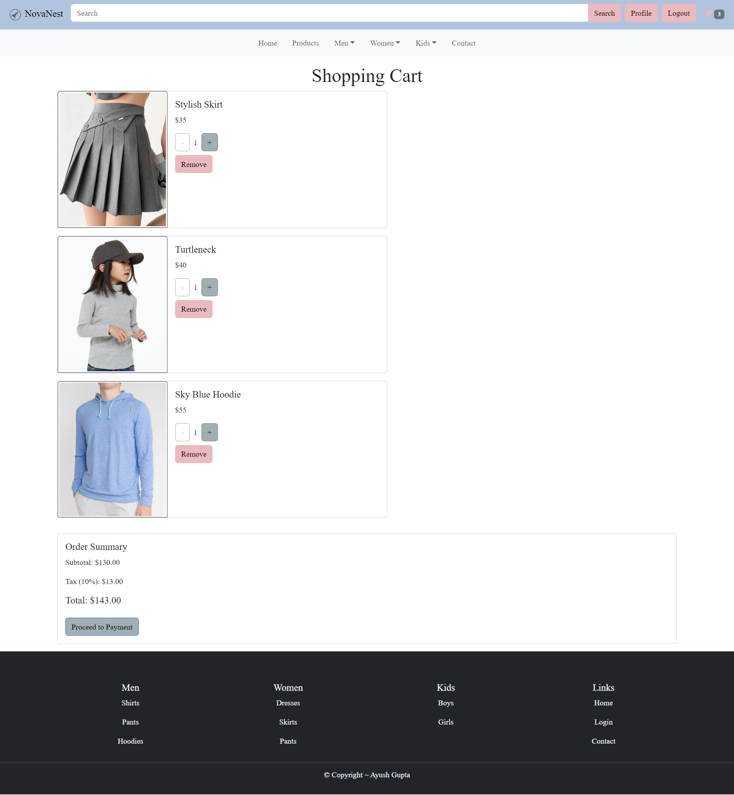

### Shipping Page

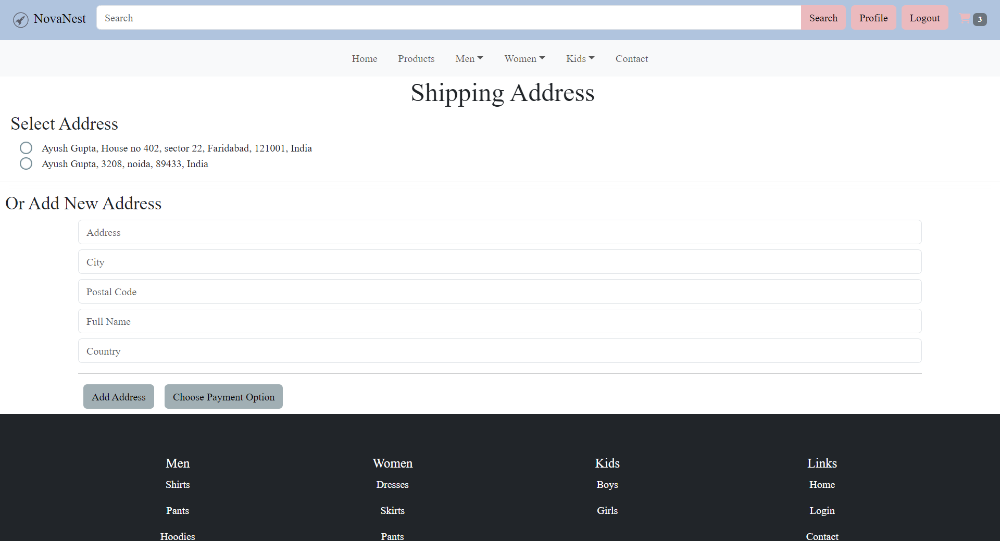

### Order Summary Page

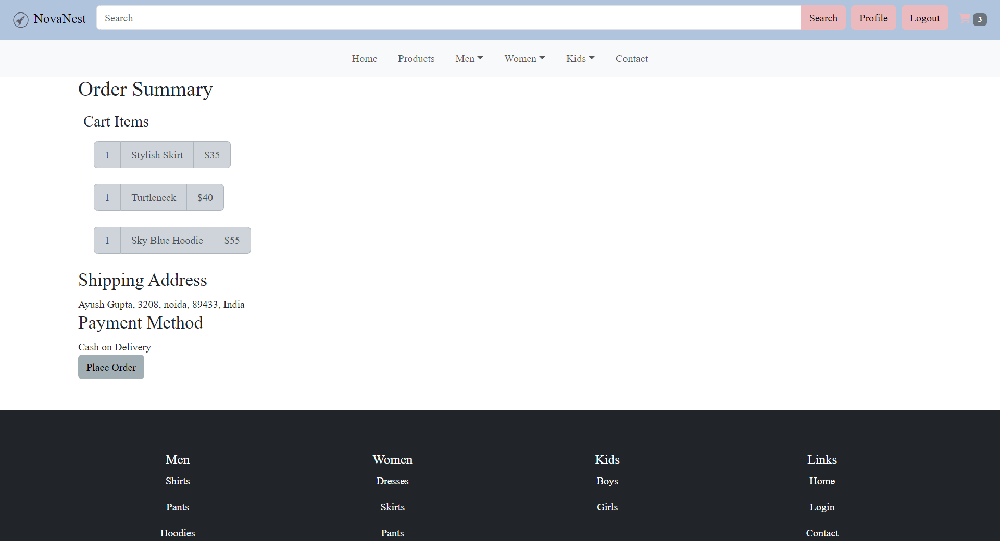

### Order Details Page


### Admin Dashboard

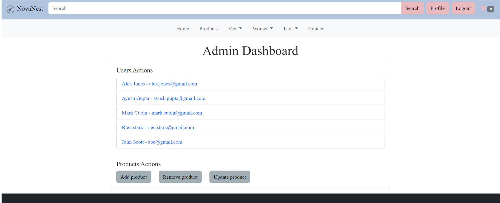

### Admin User Details

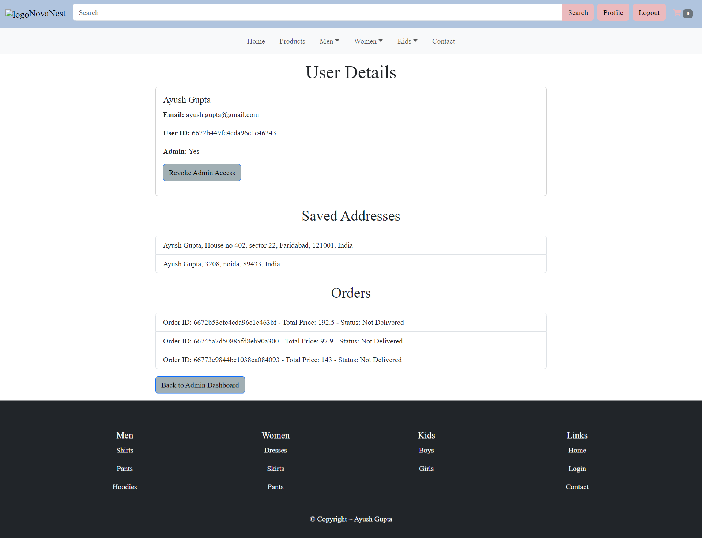

### Admin Product Actions

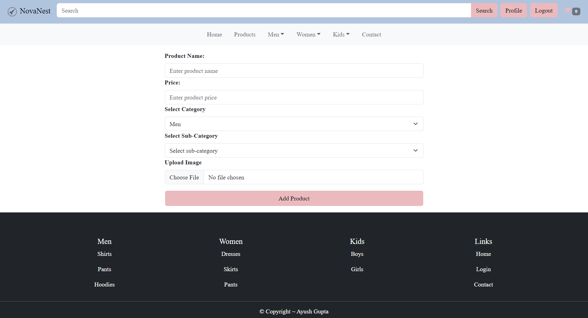

## Installation

To run this project locally, follow these steps:

1. **Clone the repository**:
   ```bash
   git clone https://github.com/evirac/MERN-Ecom.git
   cd twitter-clone
   ```
2. **Install backend dependencies**:
   ```bash
   cd backend
   npm install
   ```
3. **Install frontend dependencies**:

   ```bash
   cd frontend
   npm install
   ```

4. **Set up environment variables**:

   - Create a .env file in the backend directory with the following variables:
     .env:

   ```makefile
       MONGO_URI=your_mongodb_uri
       SECRET_KEY=your_jwt_secret
       PORT= [your port number (for ex: 5500)]
   ```

5. **Run the frontend**:

   ```bash
   cd frontend
   npm run dev
   ```

6. **Run the backend**:
   ```bash
   cd backend
   node server
   ```

## Backend

The backend is built with Node.js and Express. It includes:

- Routes: API endpoints for user and tweet management.
- Controllers: Logic for handling requests and responses.
- Models: Mongoose schemas for User and Tweet entities.
- Middleware: JWT authentication middleware to protect routes. There are 2 auths, one for users and one for admins

## Frontend

The frontend is built with React. It includes:

- Components: Reusable components for various parts of the application.
- Pages: Different pages like Home, Explore, Login, Register, and Profile.
- State Management: Used useState for local state management in React components.
- Styling: Used Sass for custom styles and Bootstrap for responsive design and components.

### Main Components and Pages

- main.jsx: Main application component.
- Home.jsx: Homepage displaying featured products.
- Products.jsx: Browse all products or filter by cateogries and sub-categories.
- Product Details Page: views order details and it's ratings and reviews.
- Login.jsx: Login page for user authentication.
- Register.jsx: Registration page for new users.
- Profile.jsx: User profile page - displays user details and order history/
- Cart Page: Displays cart items.
- Order Details Page: Displays information of the order after the order is placed. Can also be accessed via order history from profile page.
- Admin: Admin dashboard, can be accessed from profile page if the user is an admin. Gets access to admin information like details of all users registered and can toggle their admin access. Admin can also manage product operations (like add, delete and update).

### Styling

- Bootstrap: Used for responsive design and prebuilt components.
